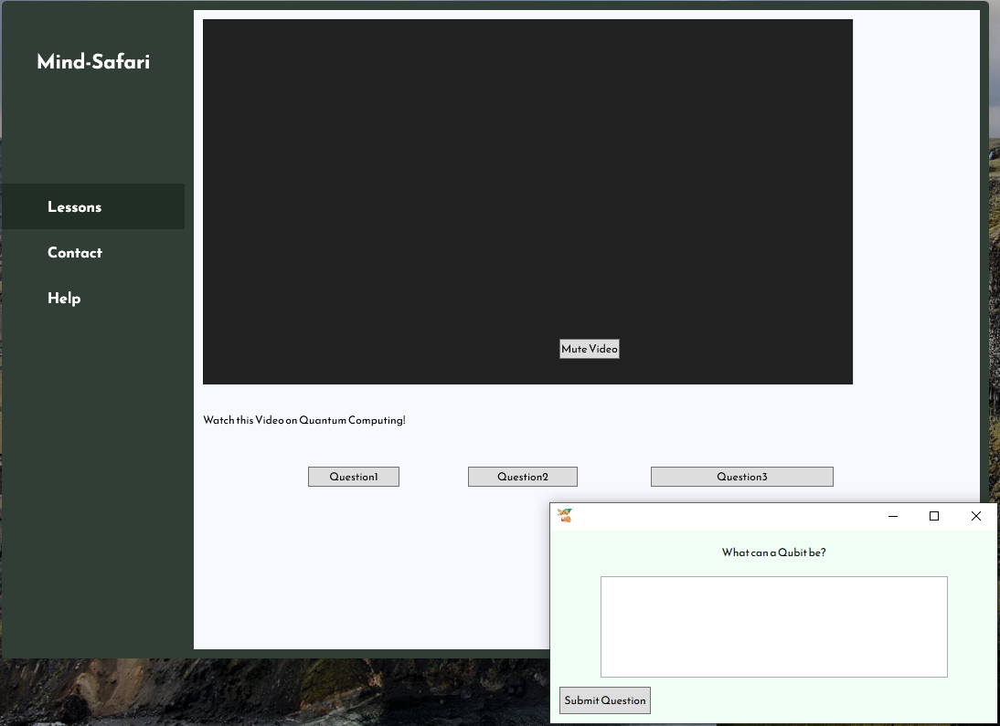
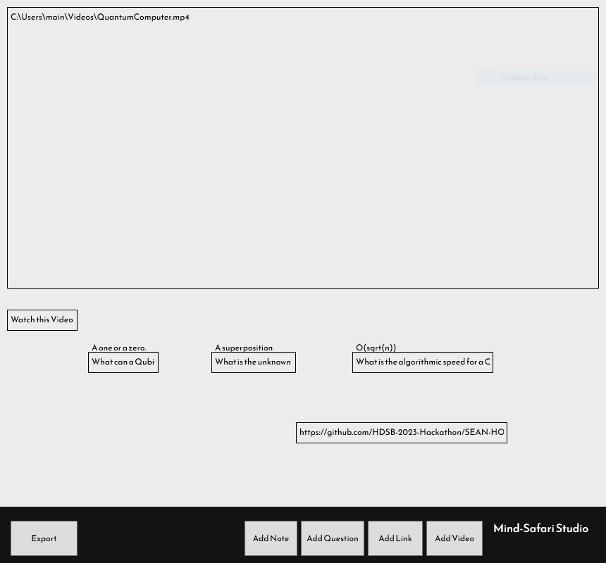

# Mind Safari
 A interactive education app and learning app for students & teachers.

## Table of Contents
 - Features 
 - Installation 
 - Usage 
 - License

## Features

Mind-Safari utilizes a private key for encryption, ensuring that lesson files are rendered unreadable to students while remaining accessible to authorized clients. MS-Studio empowers educators to rapidly create interactive and engaging lessons that are tailored to their students' needs and can be easily accessed independently.

## Installation
To Install Mind-Safari and its tools, navigate yourself to the Releases Page, 
no pre-requisites are required to be able to run Mind-Safari and its tools.

## Usage

## License
This project is released under the GNU GPLv3 License.
